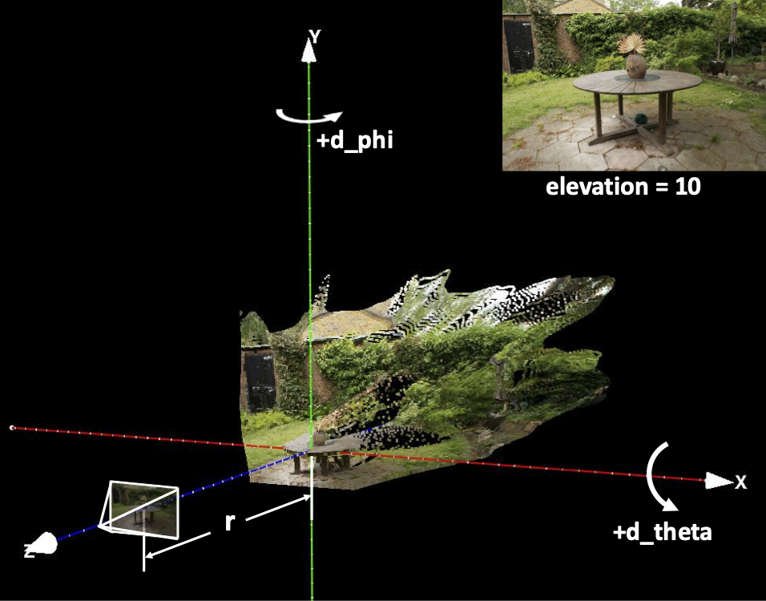

# Tutorial of the Huggingface demo

## Step 1: Input an Image, selet an elevation angle and a center_scale factor
**1.** Select an image from the examples or upload your own image as the reference image. 

**2.** Estimate an `elevation` angle that represents the angle at which the image was taken. A value bigger than 0 indicates a top-down view, and it doesn't need to be precise.

**3.** The origin of the world coordinate system is, by default, defined at the point cloud corresponding to the center pixel of the reference image. You can adjust the position of the origin by modifying `center_scale`; a value smaller than 1 brings the origin closer to the reference camera. We set it to 1 by default, but you should reduce it if the center pixel of your input image is not in the foreground, such as in the sky, which has a very large depth and will move the origin too far away from the initial camera position.

## Step 2: Input camera trajectory
**1.** We use spherical coordinate to represent the camera pose. The initial camera is located at (r, 0, 0). You should input a `d_phi sequence`, a `d_theta sequence`, and a `d_r sequence` to generate a camera trajectory. As shown in the figure above, in each sequence,  a positive d_phi moves the camera to the right, a negative d_theta moves the camera up, and a negative d_r moves the camera forward (closer to the origin). Ensure that each sequence starts with 0 and contains at least two elements (a start and an end). The program will interpolate a smooth trajectory among the poses, then rendering the point cloud along that trajectory. Below shows some simple examples which contains only a start value and an end value for each sequence:
<table class="center">
    <tr style="font-weight: bolder;text-align:center;">
        <td> center_scale </td>
        <td> d_phi sequence </td>
        <td> d_theta sequence</td>
        <td> d_r sequence</td>
        <td>Render results</td>
    </tr>
   <tr>
  <td>
    0.5
  </td>
  <td>
    0 45
  </td>
  <td>
    0 0
  </td>
  <td>
    0 0
  </td>
  <td>
    
  </td>
  </tr>
   <tr>
  <td>
    1
  </td>
  <td>
    0 45
  </td>
  <td>
    0 0
  </td>
  <td>
    0 0
  </td>
  <td>
    
  </td>
  </tr>
     <tr>
  <td>
    1
  </td>
  <td>
    0 0
  </td>
  <td>
    0 -30
  </td>
  <td>
    0 0
  </td>
  <td>
     
  </td>
  </tr>
     <tr>
  <td>
    1
  </td>
  <td>
    0 0
  </td>
  <td>
    0 0
  </td>
  <td>
   0 -0.5
  </td>
  <td>
    
  </td>
  </tr>
     <tr>
  <td>
    1
  </td>
  <td>
    0 45
  </td>
  <td>
   0 -30
  </td>
  <td>
    0 -0.5
  </td>
  <td>
     
  </td>
  </tr>
</table>

**2.** You can also create complex camera trajectories with diverse combinations. Below shows some examples: 
<table class="center">
    <tr style="font-weight: bolder;text-align:center;">
        <td> d_phi sequence </td>
        <td> d_theta sequence </td>
        <td> d_r sequence </td>
        <td> Trajectory visulization </td>
        <td>Render results</td>
    </tr>
   <tr>
  <td>0 -3 -15 -20 -17 -5 0 </td>
  <td>0 -2 -5 -10 -8 -5 0 2 5 10 8 5 0 </td>
    <td>0  0</td>
  <td>
    
  </td>
  <td>
    
  </td>
  </tr>
     <tr>
  <td>0 3 10 20 17 10 0 </td>
 <td>0 -2 -8 -6 0 2 8 6 0 </td>
 <td>0 -0.02 -0.09 -0.18 -0.16 -0.09 0</td>
  
  <td>
    
  </td>
  <td>
    
  </td>
  </tr>
         <tr>
  <td>0  40 </td>
  <td>0 -1 -3 -7 -6 -4 0 1 3 7 6 4 0 -1 -3 -7 -6 -4 0 1 3 7 6 4 0 </td>
<td>0  0</td>
  <td>
    
  </td>
  <td>
    
  </td>
  </tr>
</table>

- **Tips:** A sequence in which the differences between adjacent values increase in one direction results in a smoother trajectory. Ensure that these differences are not too large; otherwise, they may lead to abrupt camera movements, causing the model to produce artifacts such as content drift.
## Step 3: Generate video

You can reduce the sampling steps for faster inference; try different random seed if the result is not satisfying. Rember to conduct **Step 2** again if you upload a new image.

